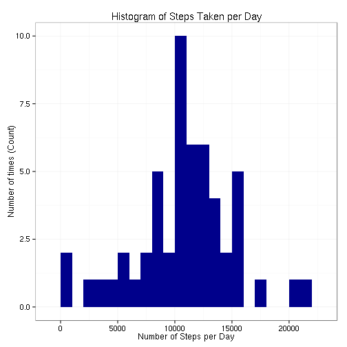
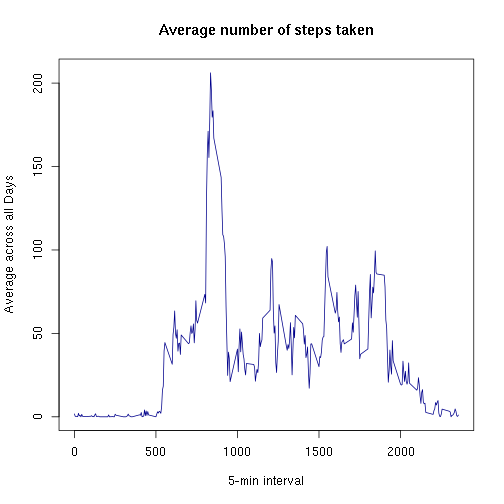
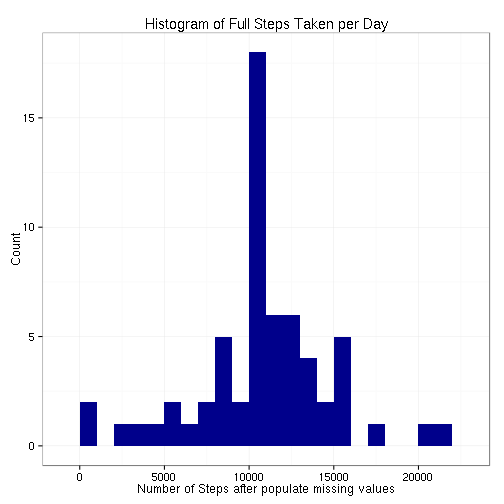
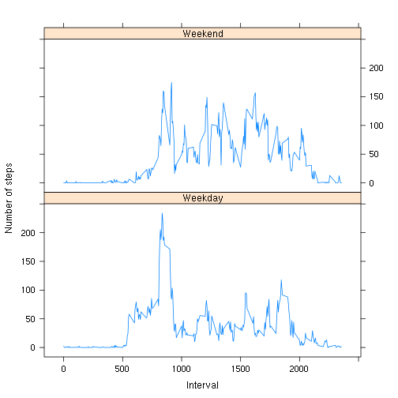

This is the R Markdown file created in purpose of peer assesment during Reproducible Research course from Coursera, e-learning platform.

# Peer Assesment 1

##Loading and preprocessing the data


```r
data <- read.table("activity.csv", header=T, quote="\"", sep=",")

# convert date to date data type
data$date <- as.Date(data$date, "%Y-%m-%d")
```

##What is mean total number of steps taken per day?


```r
steps_taken_per_day <- aggregate(steps ~ date, data, sum, na.rm=TRUE)
```

Plot the histogram:


```r
library(ggplot2)
ggplot(steps_taken_per_day, aes(x = steps)) + 
       geom_histogram(fill = "darkblue", binwidth = 1000) + 
        labs(title="Histogram of Steps Taken per Day", 
             x = "Number of Steps per Day", 
             y = "Number of times (Count)") + 
        theme_bw()    
```

 

Report mean and median of steps:


```r
mean(steps_taken_per_day$steps); 
```

```
## [1] 10766.19
```


```r
median(steps_taken_per_day$steps) 
```

```
## [1] 10765
```

##What is the average daily activity pattern?


```r
time_series <- tapply(data$steps, data$interval, mean, na.rm = TRUE)
```

Plot time series of the 5-minute interval and the average number of steps taken, averaged across all days


```r
plot(row.names(time_series), time_series, type = "l", xlab = "5-min interval", 
    ylab = "Average across all Days", main = "Average number of steps taken", 
    col = "darkblue")
```

 

Report the 5-min interval, on average across all the days in the dataset, contains the maximum number of steps:


```r
which.max(time_series)
```

```
## 835 
## 104
```

**Observations:**

Based on observed pattern, the highest activity of the person is around 8:35am. 

##Imputing missing values

Strategy:

The NA's are replaced by the mean value of the interval:


```r
StepsAverage <- aggregate(steps ~ interval, data = data, FUN = mean)
fillNA <- numeric()
for (i in 1:nrow(data)) {
    obs <- data[i, ]
    if (is.na(obs$steps)) {
        steps <- subset(StepsAverage, interval == obs$interval)$steps
    } else {
        steps <- obs$steps
    }
    fillNA <- c(fillNA, steps)
}
```

The new dataset is created but with NA's filled:


```r
new_activity <- data
new_activity$steps <- fillNA
```

Histogram:


```r
full_steps_per_day <- aggregate(steps ~ date, new_activity, sum)

ggplot(full_steps_per_day, aes(x=steps)) + 
        geom_histogram(fill="darkblue", binwidth=1000) + 
        labs(title="Histogram of Full Steps Taken per Day", 
             x="Number of Steps after populate missing values", 
             y="Count") + 
        theme_bw()  
```

 

Mean and median:

```r
mean(full_steps_per_day$steps)
```

```
## [1] 10766.19
```


```r
median(full_steps_per_day$steps)
```

```
## [1] 10766.19
```

##Are there differences in activity patterns between weekdays and weekends?

Create a factor variable daylevel with two levels (weekday, weekend). 


```r
day <- weekdays(data$date)
daylevel <- vector()
for (i in 1:nrow(data)) {
    if (day[i] == "sobota") {
        daylevel[i] <- "Weekend"
    } else if (day[i] == "niedziela") {
        daylevel[i] <- "Weekend"
    } else {
        daylevel[i] <- "Weekday"
    }
}
data$daylevel <- daylevel
data$daylevel <- factor(data$daylevel)

stepsByDay <- aggregate(steps ~ interval + daylevel, data = data, mean)
names(stepsByDay) <- c("interval", "daylevel", "steps")
```

Make a panel plot containing a time series plot (i.e. type = “l”) of the 5-minute interval (x-axis) and the average number of steps taken, averaged across all weekday days or weekend days (y-axis).


```r
library(lattice)
xyplot(steps ~ interval | daylevel, stepsByDay, type = "l", layout = c(1, 2), 
    xlab = "Interval", ylab = "Number of steps")
```

 

knit2html("PA1_template.Rmd")
